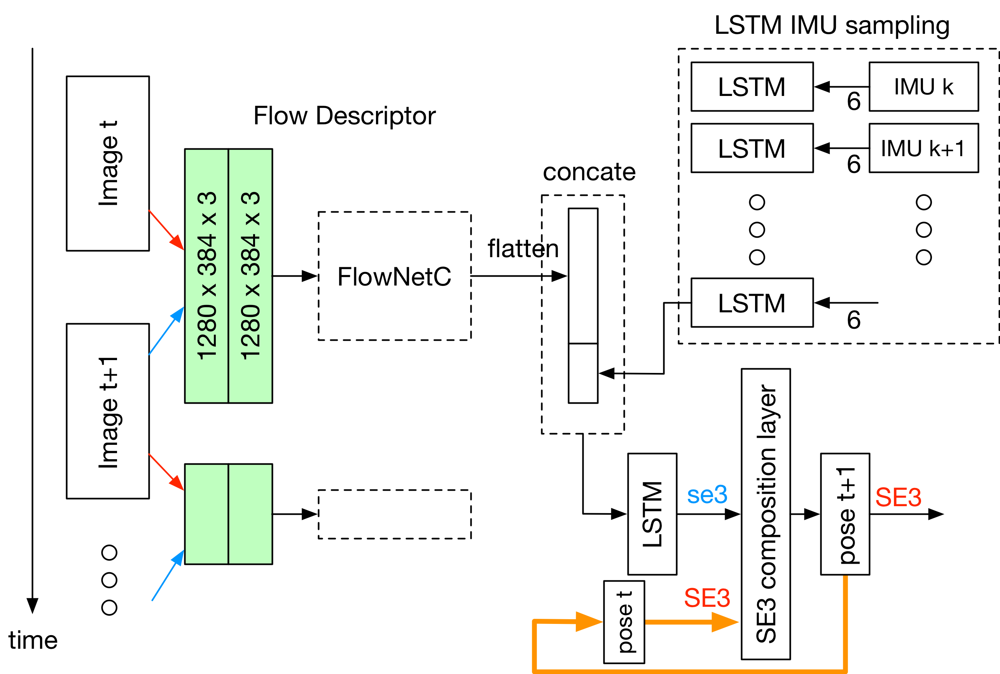

>non-official PyTorch implementation of VINet[1]

(Whole project are still under construction.)

# Installation

It's recommand to use docker image to run this project.
[Docker image installation guide](https://github.com/HTLife/VINet/wiki/Installation-Guide)

# Training
Log into container
```bash
sudo docker exec -it vinet bash
cd /notebooks/vinet
```

Execute main.py by
```bash
python3 main.py
```

# Note
## Network detail structure



[1] Clark, Ronald, et al. "VINet: Visual-Inertial Odometry as a Sequence-to-Sequence Learning Problem." AAAI. 2017.
